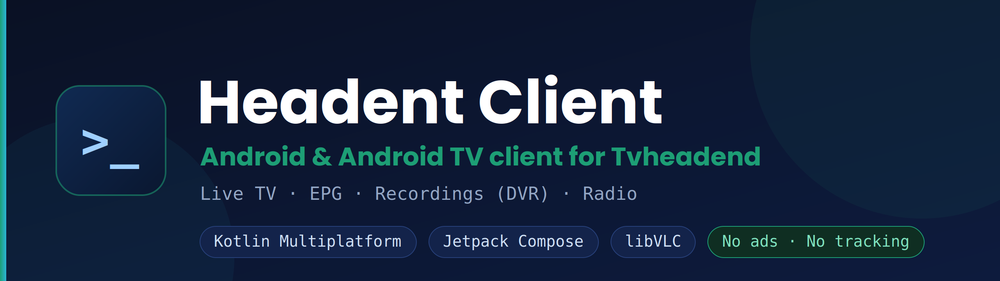

<p align="center">
  
</p>

<p align="center">
  
  
  
  
</p>

# Headent Client

Android client for [Tvheadend](https://tvheadend.org/) — live TV, EPG, recordings (DVR)
and radio, built for **Android TV boxes and phones**. Written in Kotlin Multiplatform with
Jetpack Compose and libVLC.

> **Disclaimer:** Headent Client is an independent client application and is **not** an
> official product of the Tvheadend project. The app contains **no** TV channels or
> media content — it only connects to a Tvheadend server that **you** have access to and
> configure yourself. A running Tvheadend server and valid credentials are required.

## Features

- Live TV from your Tvheadend server (HTTP and HTSP)
- EPG grid (TV guide) with fast scrolling and instant now/next from cache
- **Recording (DVR):** schedule and cancel from the guide, a programme detail or
  the player; stop running recordings and delete finished ones from the archive
- **Recording indicators:** badges for recording / recorded / scheduled, and a red
  dot on channels currently being recorded
- **DVR profile per server** — choose which recording profile the server uses,
  or leave it to the server
- Recording playback with resume and a categorized archive
- Seeking inside recordings and the archive — drag the bar or skip ±10 s (accumulating taps)
- Timeshift on live TV over HTSP (pause and skip within the server's buffer)
- Audio tracks labeled by language (not generic "Track 1 / 2 / 3")
- DVB subtitle support with a dedicated renderer
- Compact, scrollable audio/subtitle picker (tuned for TV remotes)
- **Radio channels**, told apart from TV by DVB service type (as Kodi does),
  with tag filtering and a remembered group
- **Start with the last channel (TV)** — resumes the channel or radio station you
  were last watching, with the full channel list and groups loaded
- **Teletext** (EN 300 706) decoded by the app itself, over HTSP and HTTP — colour,
  mosaic graphics, subpages, Fastext links and all European character sets;
  remote or touch controls
- **Favourites as launcher shortcuts** — favourite channels are published as app
  shortcuts with their picon (long-press the app icon on a phone; launchers such as
  Projectivity show them as tiles on Android TV); `headentclient://channel/<uuid>`
  deep links open the player on any channel.
- **Favourites in your order** — numbered 1…n inside the Favourites group,
  reorderable with the remote on TV and by dragging on the phone; the group is
  remembered after a restart and used by the player
- **Hidden channels** can be brought back from the *Hidden channels* group in the player
- Picons (channel logos)
- Channel switching by number, channel list, zapping
- Optional parental lock with PIN (configurable grace period, scope: channels / settings)
- Deinterlacing (automatic or manual: Bob, Yadif, Yadif 2x, X)
- Audio output options: passthrough to TV/AVR on Android TV, OpenSL ES mode on phones
- Optional automatic frame-rate switching (HDR mode changes off by default)
- Optional modern UI mode (home screen, player and navy/teal theme) — classic look remains the default
- Multiple servers, backup & restore of settings
- Optimized for Android TV / set-top boxes (D-pad remote) and phones, including
  recovery from standby on Amlogic boxes (sound comes back, no freezes)
- Localized into 31 languages (see below)
- No ads, no tracking, no telemetry

## Requirements

- A running [Tvheadend](https://tvheadend.org/) server you have access to
- Android 6.0 (API 23) or newer; Android TV or phone

Recording requires an account with DVR rights on the server. Timeshift is an
HTSP feature and is not available over the HTTP path.

## Localization

The app and the [project website](https://headentclient.com/) are localized into
**31 languages**:

Arabic, Bengali, Bulgarian, Chinese (Simplified), Croatian, Czech, Dutch, English,
French, German, Greek, Hindi, Hungarian, Indonesian, Italian, Japanese, Korean,
Persian, Polish, Portuguese, Romanian, Russian, Serbian, Slovak, Slovenian, Spanish,
Thai, Turkish, Ukrainian, Urdu, Vietnamese.

Translations are community-assisted; corrections and improvements are welcome via issues
or pull requests.

## Project structure

This is a Kotlin Multiplatform project. The **Android app is the actively developed
client**; an iOS target exists and shares the core but is less complete.

```
shared/        KMP core: API client (Ktor, Basic/Digest auth), models,
               HTSP, DVR classifier, secure storage
androidApp/    Jetpack Compose UI — one APK for phone and Android TV
iosApp/        SwiftUI (work in progress)
```

## Building (Android)

The app is built with Gradle. CI builds run via GitHub Actions on each push.

```
# Debug APK (installable for testing)
gradle :androidApp:assembleDebug

# Release APK (R8/minified)
gradle :androidApp:assembleRelease
```

Release signing reads `keystore.properties` from the project root (not committed). If the
file is absent (e.g. CI), the release build falls back to debug signing so the APK is
still installable for testing.

## Privacy

The app stores connection settings (incl. credentials) only locally on the device and
sends them solely to the Tvheadend server you configure. No data is sent to the developer
or any third party. See the
[Privacy Policy](https://headentclient.com/privacy-policy.html) and
[Terms of Use](https://headentclient.com/terms-of-use.html). Both are also available
in-app under Settings → Information.

## License

Released under the [MIT License](LICENSE).
